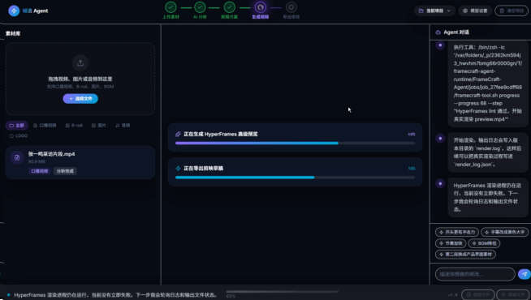

# FrameCraft-CN openJiuwen 多 Agent 版

FrameCraft-CN 将解说音频或中文讲稿转换为可预览、可下载、可继续对话修改的无人物解说视频。当前后端基于华为开源的 openJiuwen Agent Core 编排多个 DeepSeek Agent，默认把生成的 HyperFrames 工程交给用户电脑真实渲染 MP4，云服务器不再承担 Chromium 渲染负载。

本版本不处理人物口播，不生成剪映草稿，不提供 FFmpeg 拼接兜底。只要 Agent、HyperFrames 或视觉验收未通过，任务就会明确停止，不注册伪成功版本。

## 功能

- 上传音频：本地 Whisper 生成简体中文逐字稿与词级时间戳。
- 输入讲稿：先使用 Edge TTS 生成中文旁白，再按原稿生成精确字幕与场景种子。
- 多 Agent 设计：内容、视觉、时序三个专家并行工作，代码总监统一生成每个项目的创意规格。
- 动态视频：根据内容选择流程、数据、知识关系、故事时间线等场景，不复用上一项目的固定文案。
- 本地真实渲染：用户电脑上的 FrameCraft Renderer 调用 HyperFrames `--strict` 输出 1080p、24fps、H.264/AAC MP4。
- 双重验收：先用 `ffprobe` 检查音视频流与完整时长，再由 DeepSeek 视觉模型检查全片联系表。
- 项目隔离：每个项目拥有独立素材、聊天、分析、Agent 追踪与版本目录。
- 自动清理：生产环境默认只保留 24 小时，活动任务不会被中途删除。

## 演示

[查看 Bilibili 演示视频](https://www.bilibili.com/video/BV1Q6jC6QEPv/)




## 架构

```text
React 工作台
  -> FastAPI 项目与任务 API
  -> 音频预处理 / 本地 Whisper ASR
  -> openJiuwen TeamRuntime
       -> narrative: 内容结构
       -> visual: 视觉隐喻与场景形式
       -> timing: 节奏与可读性
       -> code_director: DeepSeek V4 Pro 汇总创意规格
  -> 云端生成 HyperFrames HTML 工程包
  -> 浏览器传给用户电脑的 FrameCraft Renderer
  -> 用户电脑 HyperFrames --strict 真实渲染与 ffprobe 检查
  -> 浏览器回传 MP4
  -> 云端 DeepSeek V4 Flash Vision 全片抽帧验收
  -> 注册版本与下载
```

三个专家由 openJiuwen `TeamRuntime` 并行调度，代码总监在专家完成后汇总。每次项目分析都会真实调用模型，追踪信息写入 `outputs/<project_id>/analysis/agent_trace.json`。该文件包含框架名、团队拓扑、各 Agent 模型、耗时和原始结构化结果，可确认任务确实经过 openJiuwen 与 DeepSeek。

## 模型分工

| 职责 | 默认模型 |
| --- | --- |
| 内容、视觉、时序专家 | `deepseek-v4-flash` |
| 代码总监 | `deepseek-v4-pro` |
| 成片视觉验收 | `deepseek-v4-flash-vision-exp` |

默认 OpenAI 兼容地址为 `https://api.deepseek.com`。密钥只通过环境变量或受保护的后端设置提供，不应写入仓库、前端源码、日志或 README。

## 环境要求

- Python 3.11
- Node.js 22 或更高版本
- npm
- ffmpeg 与 ffprobe
- Chromium 或 Chrome
- 可用的 DeepSeek API Key
- HyperFrames CLI，项目当前锁定 `0.7.41`

Ubuntu 依赖示例：

```bash
sudo apt-get update
sudo apt-get install -y python3.11 python3.11-venv ffmpeg curl fonts-noto-cjk
```

## 安装

```bash
git clone https://github.com/Karl-XZ/FrameCraft-CN.git
cd FrameCraft-CN
./scripts/setup-deps.sh
```

安装脚本会创建独立的 `backend/venv-openjiuwen`，安装 `openjiuwen==0.1.17.post1`、FastAPI、OpenAI SDK、前端依赖与 HyperFrames。

检查环境：

```bash
./scripts/verify-env.sh
```

## 配置

推荐使用环境变量：

```bash
export DEEPSEEK_API_KEY='your-key'
export DEEPSEEK_BASE_URL='https://api.deepseek.com'
```

不要把真实密钥写入 `.env.example`、Docker 镜像、Git 提交或浏览器构建产物。前端模型设置不会回显已保存的密钥。

可选运行参数：

```bash
export FRAMECRAFT_BACKEND_HOST=0.0.0.0
export FRAMECRAFT_BACKEND_PORT=8022
export FRAMECRAFT_RETENTION_ENABLED=1
export FRAMECRAFT_RETENTION_HOURS=24
export FRAMECRAFT_RENDER_TARGET=local
```

## 启动

```bash
./scripts/start-backend.sh
./scripts/start-frontend.sh
```

每台需要渲染的用户电脑还要启动本地 Renderer：

```bash
npm install
npm run local-renderer
```

macOS/Linux 也可以运行 `./scripts/start-local-renderer.sh`，Windows 可以双击 `scripts/start-local-renderer.cmd`。本地服务只监听 `127.0.0.1:19186`，不接收 DeepSeek Key 或服务器访问口令。默认允许来源为 `http://1.14.46.26` 和本机开发地址；更换正式域名后可设置：

```bash
export FRAMECRAFT_LOCAL_RENDERER_ORIGINS='https://your-framecraft.example.com'
```

健康检查：

```bash
curl http://127.0.0.1:8022/api/health
```

预期响应：

```json
{"ok":true,"mode":"openjiuwen-multi-agent"}
```

除健康检查外，API 默认要求访问口令。首次启动会生成 `backend/storage/access_token.txt`，文件权限设置为仅当前用户可读写。浏览器首次打开时可通过 `?access_token=<token>` 写入当前浏览器本地存储，之后 URL 中的口令会自动移除。

## 生成流程

1. 在网页新建项目并选择 16:9 或 9:16。
2. 上传一条解说音频，或直接输入中文讲稿。
3. 点击开始分析，等待 openJiuwen 团队完成内容、视觉、时序和代码设计。
4. 查看方案后点击生成。
5. 网页连接用户电脑上的 Renderer，执行 HyperFrames 严格渲染与本地 `ffprobe` 检查。
6. 网页回传 MP4，云端完成全片联系表和视觉 Agent 验收。
7. 在项目聊天中提出修改要求，Agent 会在当前项目上下文内生成新版本。

## 质量门槛

- 音频必须完整保留，成片时长与输入时长误差受控。
- 字幕来自逐字稿，使用简体中文，固定在底部安全区居中显示。
- 观众画面不得出现“场景、制作、动画、工作流、Agent”等幕后文案。
- 不允许伪造数据；原稿没有数值时使用定性信息图。
- 流程类画面逐节点出现，不把整张流程图当作一页 PPT 一次展示。
- 圆角、半透明、布局密度和动画节奏必须通过全片抽帧检查。
- HyperFrames 以 `--strict` 运行，lint 硬错误会直接阻止版本注册。
- 视觉评分低于 75 或视觉模型判断失败时，任务不会注册版本。

## 五分钟基准

仓库提供真实 60 秒音频基准脚本。它会为每一轮重新创建项目、上传、ASR、调用四个 DeepSeek Agent、生成 HTML、严格渲染、视觉验收和 `ffprobe` 检查，不复用上一轮创意结果。

```bash
backend/venv-openjiuwen/bin/python scripts/benchmark_openjiuwen_60s.py \
  /absolute/path/to/real-60s.wav --api http://127.0.0.1:8022 --runs 3
```

2026-09-10 在 Apple Silicon 8 核机器上的连续三轮实测：

| 轮次 | 画幅 | 分析 | 生成与验收 | 端到端 | 视觉评分 |
| --- | --- | ---: | ---: | ---: | ---: |
| 1 | 16:9 | 18.11 秒 | 58.31 秒 | 76.51 秒 | 88 |
| 2 | 9:16 | 18.11 秒 | 60.34 秒 | 78.54 秒 | 88 |
| 3 | 16:9 | 18.12 秒 | 56.33 秒 | 74.55 秒 | 88 |

三轮最大端到端耗时 78.54 秒，平均 76.53 秒。原始结构化结果位于 `benchmark-results/openjiuwen-60s-20260910-005244.json`。本地渲染模式下，云端只负责 ASR、Agent、工程打包和最终视觉验收，整体耗时还会受到用户电脑性能与上传速度影响。

## 本地渲染安全边界

- Renderer 只绑定回环地址，不开放局域网或公网端口。
- 浏览器下载工程包时使用服务器访问口令；口令不会传给 Renderer。
- Renderer 只接收 ZIP 二进制，拒绝目录穿越路径，并在系统临时目录隔离执行。
- 同一时间只允许一个本地渲染任务，临时工程与 MP4 默认一小时后删除。
- Renderer 不提供 FFmpeg 合成兜底；HyperFrames 严格渲染失败会原样返回错误。
- 云端收到 MP4 后仍要检查完整时长、音视频流和视觉质量，未通过不会激活版本。

## 产物

```text
outputs/<project_id>/
  analysis/
    analysis.json
    edit_plan.json
    creative_plan.json
    agent_trace.json
  <version_id>/
    preview.mp4
    subtitles.srt
    timeline.json
    visual-review.jpg
    agent_visual_review.json
    agent_trace.json
    local_render_manifest.json
    hyperframes/
    hyperframes_project.zip
```

## 自动清理

后端启动时会清理超过保留期且没有活动任务的项目。服务器还可以每小时执行：

```bash
FRAMECRAFT_RETENTION_HOURS=24 ./scripts/cleanup-expired.sh
```

只查看待删除内容：

```bash
./scripts/cleanup-expired.sh --dry-run
```

## 参考

- [openJiuwen Agent Core](https://github.com/openJiuwen-ai/agent-core)
- [openJiuwen 文档](https://docs.openjiuwen.com/)
- [DeepSeek API 文档](https://api-docs.deepseek.com/)
- [HyperFrames](https://github.com/nateherk/hyperframes)
